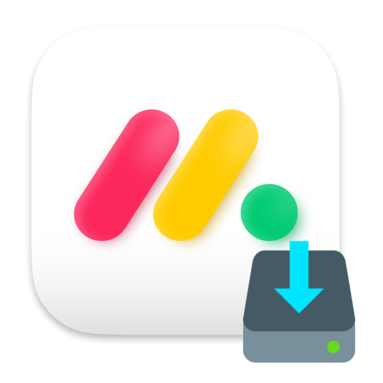

<p align="center">
    
    <h1 align="center">MndyInstaller</h2>
</p>

This installer will make sure you're all set-up to start writing your first line of code at monday.com 🚀👩‍💻👨‍💻

If you're interested in the specific pieces being installed, check out the [**steps**](https://github.com/DaPulse/mndyinstaller/tree/master/src/steps) folder for a detailed rundown.

## Prerequisites

Before you run the script, you'll need the following:

- A GitHub.com account associated with the monday.com GitHub Organization
- An npm.js account associated with the monday.com GitHub Organization

Once you create your account, open an IT Ticket to be added to the organization (or make sure it's taken care of during your IT onboarding). Then, come back to this page.

## Running the tool

1. Download **mndyinstaller** from the [latest release](https://github.com/DaPulse/mndyinstaller/releases/latest)

2. Open a terminal and grant the script with the following permissions to run:

```sh
sudo xattr -r -d com.apple.quarantine ./mndyinstaller
chmod u+x ./mndyinstaller
```

3. Run the script and follow the on-screen instructions.

```sh
./mndyinstaller
```

> [!TIP]
> The default development path is `~/Development`. If you want to customize it, make sure `MONDAY_PATH` is set in your `~/.zshrc` and environment before running this script.

## Troubleshooting

If any step fails, sometimes opening a new terminal session and re-running the script can assist. 

If you have other questions, feel free to reach out to the [#dev4devs Slack channel](https://monday.slack.com/archives/C034VLARPJS) for support.

## Contribute

The basic steps are in an array at src/basicSteps.ts
You can go there and add steps or find the step you want to fix
